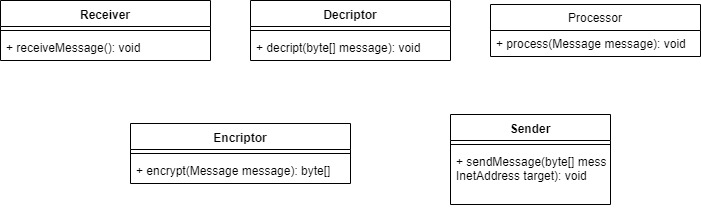

### Ваше завдання реалізувати наступні команди:
* Взнати кількість товару на складі
* Списати певну кількість товару
* Зарахувати певну кількість товару
* Додати групу товарів
* Додати назву товару до групи
* Встановити ціну на конкретний товар

_Як ви розумієте при роботі в багато потоків будуть виникати конфлікти. Так припустимо два потоки зчитають кількість товару (гречка), отримають 100 упаковок, обидва додадуть певну кількість, припустимо перший додасть 10 упаковок, а другий 20 упаковок. На складі після цієї операції буде 110, 120 або 130 упаковок ..._
### Необхідно зробити наступні класи:
* Інтерфейс що приймає повідомлення по мережі.
* Фейкова реалізація інтерфейсу, що генерує довільні повідомлення.
* Клас, що в багато потоків розбирає, дешифрує та перетворює повідомлення в об'єкт домену. Після чого передає на обробник повідомлення
* Клас, що в багато потоків приймає перетворене повідомлення та формує відповідь. Поки достатньо відповіді Ок.
* Клас, що в багато потоків шифрує відповідь та відправляє класу, що відповідає за передачу інформації по мережі
* Фейкова реалізація відправки, що просто виводить інформацію на екран.
* Система має коректно завершувати роботу
* Створити JUnit тести, що в багато потоків відправляють повідомлення

